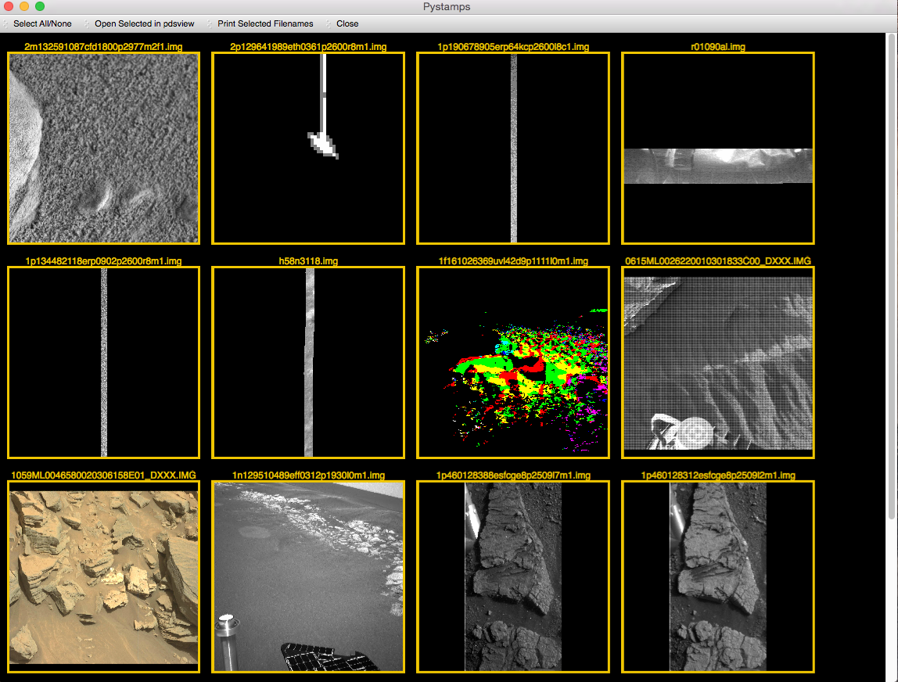
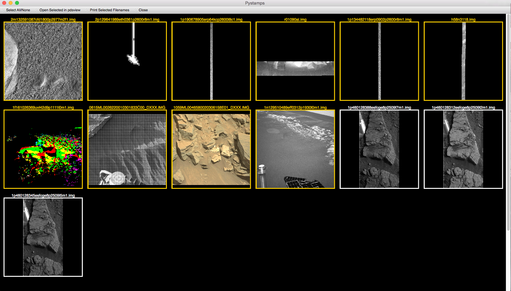

===============================
pystamps
===============================

.. image:: https://travis-ci.org/planetarypy/pystamps.svg
        :target: https://travis-ci.org/planetarypy/pystamps

.. image:: https://img.shields.io/pypi/v/pystamps.svg
        :target: https://pypi.python.org/pypi/pystamps


pystamps is a PDS image thumbnail browser.  It is alpha quality software and
not affiliated with NASA.

* Free software: BSD license

Features
--------

This is a still a work in progress and is alpha quality software.

* Currently available features:

    * Display Images
    * Select Images
    * Print Image paths
    * Resize window and wrap images
    * Command Line arguments

        * pystamps

            * Displays all PDS compatible images in current directory

        * pystamps [filename or glob]

            * Displays single image or all images matching glob that are PDS
              compatible

    * open in pdsview

        * Needs install first:

            * pip install pdsview


Install
--------

```
git clone git@github.com:planetarypy/pystamps.git
pip install -r requirements.txt
```

You must also install PySide, PyQt4, or PyQt5 (PyQt5 recommended)

Screen Shots
------------

Default view:



Wrap Images and select images:


